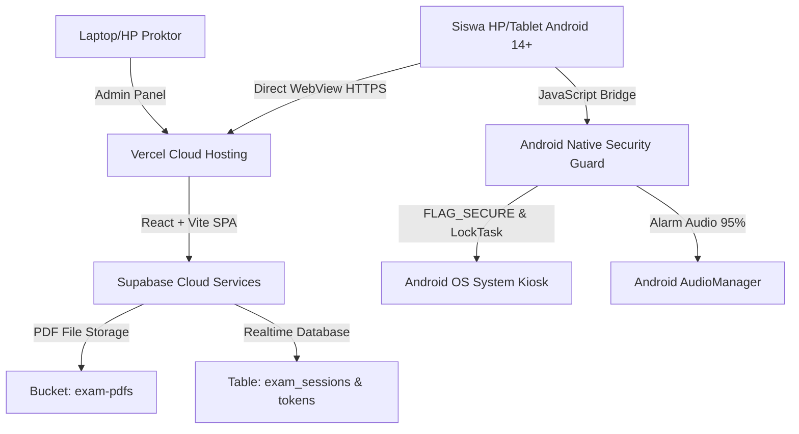
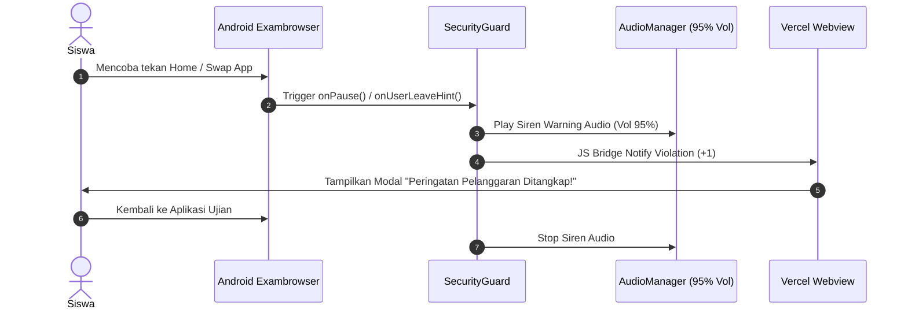

# Spesifikasi Desain & Arsitektur Sistem (Desain.md)
## Aplikasi Exambrowser Android & Webview Ujian Sumatif SMP THHK

---

## 1. Arsitektur Sistem (High-Level Architecture)

Sistem ini terbagi menjadi 3 lapisan (*layers*) utama:

---

## 2. Struktur Proyek & Komponen Utama

### A. Web Application (`web_app/`)
- **`lib/supabase.js`**: Client SDK Supabase & local stores helper (termasuk penyimpanan presensi siswa, TTD digital, berita acara, dan status kuncian token).
- **`components/admin/PdfUploader.jsx`**: Modul Super Admin untuk unggah file PDF tunggal, link Google Drive, **Batch Upload Banyak PDF Sekaligus (Smart Filename Parser)**, Master Switch Token, dan **Master Exam Bank Manager**.
- **`components/admin/OfficialMinutesForm.jsx`**: Form Berita Acara Ujian yang wajib diisi Proktor saat login awal sebelum membuka rilis token.
- **`components/admin/ProctorTokenMonitor.jsx`**: Dashboard Proktor real-time dengan tab **Rilis Token**, **Rekap Presensi & TTD Digital Siswa**, serta **View/Edit Berita Acara**.
- **`components/viewer/StudentAttendanceModal.jsx`**: Modal Canvas Tanda Tangan Digital yang wajib diisi siswa setelah token 6-karakter divalidasi.
- **`components/viewer/MobilePdfViewer.jsx`**: Penampil naskah soal PDF berbasis `pdfjs-dist` dengan gestur *pinch-to-zoom*, *bookmark* halaman bacaan, dan pengatur skala cepat (A-/A/A+).
- **`components/viewer/StudentTokenScreen.jsx`**: Form konfirmasi data peserta & masukan Token Ujian 6-karakter.
- **`components/viewer/ExamTimerHeader.jsx`**: Barikade atas berisi Jam Realtime, Indikator Baterai (via JS Bridge), Timer Hitung Mundur, dan Tombol "Bantuan Pengawas".

### B. Native Android Application (`android_app/`)
- **`MainActivity.java`**: Main Activity pengelola WebView fullscreen, `FLAG_SECURE`, Immersive Sticky System Bars, dan LockTask Mode (`startLockTask()`).
- **`WebBridge.java`**: Komunikasi dua arah antara WebView JavaScript dan Native Android (Battery Level, Current System Time, Siren Alarm Sound Trigger 95% Volume, Exit Password Modal Validation).
- **`SecurityGuard.java`**: Worker thread pemantau aplikasi mengambang (Floating Apps Overlay), App Switching (`onPause`), status Bluetooth (`BluetoothAdapter`), dan Headset (`ACTION_HEADSET_PLUG`).
- **`ExitPasswordDialog.java`**: Dialog modal masukan password `12345` untuk pengawas saat ingin menutup aplikasi atau keluar ujian.

---

## 3. Desain UI/UX & Palette Warna (Pusmendik ANBK Modern)

Aplikasi mengadopsi skema warna profesional berstandar Kemendikdasmen ANBK dengan estetika tinggi:

- **Primary Color (Biru Pusmendik):** `#1A56DB` (Header, Tombol Utama, Accent Active)
- **Secondary / Accent (Kuning ANBK):** `#EAB308` (Status Ragu / Indikator Timer Peringatan)
- **Success Color (Hijau Sesi):** `#16A34A` (Status Terhubung, Token Aktif)
- **Danger / Alarm (Merah Pelanggaran):** `#DC2626` (Peringatan Keluar Apps, Siren Audio State)
- **Neutral Dark (Teks & Kontras):** `#1F2937`
- **Neutral Light (Latar Belakang Canvas PDF):** `#F9FAFB` / `#FFFBEB` (Sepia Mode) / `#111827` (Dark Mode)

---

## 4. Skema Basis Data & Storage (Supabase)

### Table: `exam_sessions`
- `id` (uuid, primary key)
- `title` (text) - Contoh: "Sumatif Bahasa Indonesia Class 8"
- `subject` (text)
- `grade` (text)
- `duration_minutes` (int)
- `pdf_path` (text) - Path file di Supabase Storage
- `current_token` (varchar 6) - Token rilis aktif
- `token_updated_at` (timestamp)
- `created_at` (timestamp)

### Table: `student_logs`
- `id` (uuid, primary key)
- `exam_id` (uuid, foreign key)
- `student_name` (text)
- `nisn` (text)
- `status` (text) - `'ACTIVE'`, `'HELP_NEEDED'`, `'DISCONNECTED'`
- `violations_count` (int) - Hitungan siswa mencoba pindah apps
- `last_active_at` (timestamp)

---

## 5. Proteksi Anti-Kecurangan & Alur Peringatan Audio

